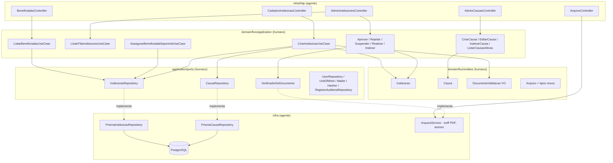

# Catálogo de Instituições e Causas Design

**Spec**: `.specs/features/catalogo-instituicoes/spec.md`
**Status**: Draft

> Convenção: nomes de seção e palavras-chave em inglês, conteúdo em português (AD-005).
> Arquitetura de **AD-017** (hexagonal completa, contexto único `src/domain/fivo/`, rich domain model).

---

## Escopo deste design

Rodada **P1 (MVP) do `api`**, decidida com o usuário em 2026-09-20:

1. **Autocadastro da instituição** — `usuario` (papel `INSTITUICAO`) + perfil `instituicao`, documento de validação obrigatório, causa obrigatória, estado inicial `PENDENTE_APROVACAO`.
2. **Fila e decisões do administrador** — aprovar, rejeitar, suspender, reativar, inativar, com auditoria e e-mail.
3. **Curadoria de causas** — criar, editar e inativar causa; causa é pré-requisito do autocadastro.
4. **Catálogo de beneficiadas** — listagem e busca das instituições `APROVADA` + causas `ATIVA`, e a guarda de disponibilidade que `campanhas` vai consumir.

**Fora desta rodada:**

| Item | Onde fica |
| ---- | --------- |
| P2 — área logada da instituição (edição, substituição do documento, reanálise) e notas internas de curadoria | rodada posterior desta mesma feature |
| Amarrar a beneficiada à criação/edição de campanha (`CriarCampanhaUseCase`) e bloquear aprovação de campanha com beneficiada indisponível | feature `campanhas` — aqui entregamos apenas a guarda `AssegurarBeneficiadaDisponivelUseCase` e ela fica sem chamador |
| Telas do `web` (NextJS) | rodada separada, como em `cadastro-empresa` |
| Mensagem de estado vazio "Nenhuma instituição disponível no momento" (P1-Seleção AC6) | `web`; o domínio devolve lista vazia e a API devolve `[]` |
| Escape de HTML na renderização (Edge case) | `web`; a API armazena e devolve o texto como veio, em JSON |

---

## Approach

A arquitetura não está em aberto: **AD-017** fixa hexagonal completa com rich domain model, e esta feature é o espelho de `cadastro-empresa` para um segundo papel. O design, portanto, é majoritariamente **simetria deliberada** — cada peça nova tem uma peça equivalente já implementada, testada e verificada na empresa.

| Decisão | Escolha | Origem |
| ------- | ------- | ------ |
| Identidade da instituição | `Usuario` (papel `INSTITUICAO`) + perfil `Instituicao` 1–1, criados na mesma transação (`UnitOfWork`) | AD-013, AD-008 |
| Unicidade | `email` único **global** em `usuario`; `cnpj` único **na tabela `instituicao`** (empresa e instituição podem repetir CNPJ) | AD-013, spec Edge case |
| Onde mora a regra | Invariante de estado → método na entidade; valor restrito → value object; regra entre registros → caso de uso | AD-017 (nota rich domain) |
| Máquina de estados | `PENDENTE_APROVACAO → APROVADA/REJEITADA`, `REJEITADA → PENDENTE_APROVACAO`, `APROVADA → SUSPENSA/INATIVA`, `SUSPENSA → APROVADA`; qualquer outra = 409 | spec P1-Aprovação AC5 |
| Concorrência de decisão | `salvarTransicao(entidade, estadoEsperado)` (compare-and-swap), idêntico a `EmpresaRepository` | spec P1-Aprovação AC10; AD-019 |
| Beneficiada | XOR instituição/causa validado por caso de uso dedicado, sem coluna polimórfica | AD-006 (a) |
| Documento de validação | Registro em `arquivo` (AD-006 b), com tipo próprio e limites próprios; nunca exposto publicamente | AD-016, spec Out of Scope |
| Autoria do código | Domínio por humanos, infra por agente | **AD-020** (nova, ver STATE) |

---

## Architecture Overview



---

## Code Reuse Analysis

### Componentes existentes a aproveitar

| Componente | Local | Como usar |
| ---------- | ----- | --------- |
| `Empresa` (máquina de estados com `Either`) | `src/domain/fivo/entities/empresa.ts` | Modelo literal para `Instituicao.aprovar/rejeitar/suspender/reativar` — mesma forma, mesmos erros |
| `Cnpj`, `Senha` | `src/domain/fivo/entities/{cnpj,senha}.ts` | Reaproveitados sem alteração |
| `Arquivo.criar` | `src/domain/fivo/entities/arquivo.ts` | Estendido com `LOGO_INSTITUICAO` e `DOCUMENTO_INSTITUICAO`; a tabela de formatos por tipo já existe, falta a de limites por tipo |
| `CriarEmpresaUseCase` | `.../use-cases/criar-empresa.ts` | Modelo de `CriarInstituicaoUseCase`: `Senha` → `Cnpj` → unicidade → `UnitOfWork` → e-mail best-effort |
| `AprovarEmpresaUseCase` | `.../use-cases/aprovar-empresa.ts` | Modelo das decisões: papel ADMIN → carregar → método da entidade → `salvarTransicao` → auditoria → e-mail |
| `ListarFilaAprovacaoUseCase` | `.../use-cases/listar-fila-aprovacao.ts` | Modelo de `ListarFilaInstituicoesUseCase` |
| `EmpresaRepository` (`salvarTransicao`, `listarPorEstado`) | `.../ports/database/empresa-repository.ts` | Contrato copiado para `InstituicaoRepository` |
| `UnitOfWork`, `Mailer`, `Hasher`, `RegistroAuditoriaRepository`, `Storage` | `.../ports/` | Reusados sem alteração |
| `InMemoryEmpresaRepository` (CAS reproduzido) | `test/repositories/in-memory-empresa-repository.ts` | Modelo do `InMemoryInstituicaoRepository` reescrito |
| `ArquivoService` (sniff, storage, `buscarAcesso`) | `src/infra/arquivo/arquivo.service.ts` | Estendido: magic bytes de PDF, limites por tipo, dono instituição |
| `PrismaEmpresaRepository` + mapper | `src/infra/database/prisma/` | Modelo dos adaptadores de `Instituicao` e `Causa` |
| `AdminEmpresasController`, `CadastroEmpresaController` | `src/infra/http/controllers/` | Modelo dos controllers, inclusive multipart, `@Roles`, `desembrulhar` e decorators OpenAPI |
| `DomainExceptionFilter` | `src/infra/http/domain-exception.filter.ts` | Já mapeia `status` de erro de aplicação → HTTP; erros novos só precisam do campo `status` |

### Integration points

| Sistema | Integração |
| ------- | ---------- |
| Autenticação (AD-012) | `AutenticarUsuarioUseCase` já é agnóstico de papel; instituição loga assim que existir `Usuario` com `role = INSTITUICAO`. Nenhuma alteração nesta rodada |
| `campanhas` | Consome `AssegurarBeneficiadaDisponivelUseCase` e o `InstituicaoRepository`; `CriarCampanhaUseCase` atual referencia `Instituicao` e será realinhado lá |
| `paginas-publicas` | Consome o read model de `ListarBeneficiadasUseCase`, que já exclui documento, e-mail, telefone e notas |
| `openapi.json` | O teste de paridade (`test/http/openapi-paridade.e2e-spec.ts`) falha se uma rota nova não for documentada — documentação entra na mesma task do controller |

---

## Components

### Domínio — `api/src/domain/fivo/` (autoria humana)

#### `Causa` (entidade)

- **Purpose**: taxonomia curada pelo admin que agrupa instituições e pode ser beneficiada direta de uma campanha.
- **Location**: `src/domain/fivo/entities/causa.ts`
- **Interfaces**:
  - `static criar(props): Either<NomeCausaInvalidoError, Causa>` — `nome` não vazio e ≤ 80 caracteres; estado inicial `ATIVA`
  - `editar(nome, descricao): Either<NomeCausaInvalidoError | TransicaoInvalidaError, void>` — proibido editar causa `INATIVA`
  - `inativar(): Either<TransicaoInvalidaError, void>` — só a partir de `ATIVA`
  - `estaAtiva(): boolean`
- **Props**: `nome`, `descricao`, `status: CausaStatus{ATIVA,INATIVA}`, `createdAt`, `updatedAt`
- **Reuses**: forma de `Empresa` (props privadas, sem setter público, `Either` nas transições)

#### `DocumentoValidacao` (value object)

- **Purpose**: concentrar a obrigatoriedade do documento e o limite da descrição livre num só lugar testável.
- **Location**: `src/domain/fivo/entities/documento-validacao.ts`
- **Interfaces**:
  - `static criar(arquivoId?: string | null, descricao?: string | null): Either<DocumentoObrigatorioError | DescricaoDocumentoInvalidaError, DocumentoValidacao>` — `arquivoId` obrigatório (AC6), `descricao` opcional com ≤ 200 caracteres (AC7)
  - `get arquivoId(): UniqueEntityId`, `get descricao(): string | null`
- **Reuses**: `Cnpj`/`Senha` como forma de VO validante

#### `Instituicao` (entidade — **retrabalho** do rascunho existente)

- **Purpose**: perfil da instituição e sua máquina de estados de elegibilidade.
- **Location**: `src/domain/fivo/entities/instituicao.ts` (reescrita no lugar)
- **Mudanças em relação ao rascunho**: remove todos os setters públicos; remove `email` (vive em `usuario`, AD-013); `numero` passa a `string` (simetria com `Empresa`); `decididoPor` passa a `UniqueEntityId`; nomes em camelCase; acrescenta `usuarioId`, `causaId`, `descricao`, `logoArquivoId`, `documento: DocumentoValidacao`; acrescenta `INATIVA` ao enum
- **Interfaces**:
  - `static create(props, id?): Instituicao` — estado inicial `PENDENTE_APROVACAO`
  - `aprovar(adminId): Either<TransicaoInvalidaError, void>`
  - `rejeitar(adminId, motivo): Either<TransicaoInvalidaError | MotivoInsuficienteError, void>` — motivo ≥ 20 caracteres
  - `suspender(adminId)`, `reativar(adminId)`, `inativar(adminId): Either<TransicaoInvalidaError, void>`
  - `reenviarParaAnalise(): Either<TransicaoInvalidaError, void>` — `REJEITADA → PENDENTE_APROVACAO` (consumido pela P2; aqui só a regra e seu teste)
  - `estaDisponivelParaSelecao(): boolean` — `true` só em `APROVADA`
- **Reuses**: `Empresa` inteiramente

#### `Arquivo` — tipos e limites por tipo

- **Purpose**: aceitar o documento de validação (PDF/JPG/PNG até 10 MB, sem mínimo de dimensão) e o logo da instituição (mesmas regras do logo de empresa).
- **Location**: `src/domain/fivo/entities/arquivo.ts` (modificar)
- **Mudança**: `TipoArquivo` ganha `LOGO_INSTITUICAO` e `DOCUMENTO_INSTITUICAO`; o limite de 5 MB deixa de ser constante única e vira tabela por tipo (`DOCUMENTO_INSTITUICAO` = 10 MB); a exigência de 512×512 px passa a valer só para os tipos de logo.

#### Erros de aplicação novos — `src/domain/fivo/application/errors/`

| Erro | `status` | Mensagem |
| ---- | -------- | -------- |
| `DocumentoObrigatorioError` | 422 | `Anexe um documento que comprove a existência da instituição` |
| `DescricaoDocumentoInvalidaError` | 422 | `A descrição do documento deve ter no máximo 200 caracteres` |
| `CausaIndisponivelError` | 422 | `Causa inválida ou inativa` |
| `CausaJaExisteError` | 409 | `Causa já cadastrada` |
| `CausaComInstituicoesAprovadasError` | 409 | `Causa possui instituições aprovadas vinculadas` + `instituicoes: string[]` |
| `NomeCausaInvalidoError` | 422 | `Nome da causa inválido` |
| `BeneficiadaIndisponivelError` | 422 | `Instituição ou causa indisponível` |
| `BeneficiadaAmbiguaError` | 422 | `Informe exatamente uma beneficiada: instituição ou causa` |
| `DocumentoIndisponivelError` | 503 | `Documento temporariamente indisponível` |

Além disso, `InstituicaoAlreadyExistsError` muda de `status 422` para **409** e passa a usar a mensagem `CNPJ ou e-mail já cadastrado` (spec P1-Autocadastro AC3, igual a `EmpresaAlreadyExistsError`).

#### Portas

| Porta | Local | Operações |
| ----- | ----- | --------- |
| `InstituicaoRepository` (expandir) | `application/ports/database/instituicao-repository.ts` | `findById`, `findByCnpj`, `findByUsuarioId`, `listarPorEstado(estado, ordem)`, `listarAprovadasPorCausa(causaId)`, `buscarDisponiveis(termo?)`, `create`, `save`, `salvarTransicao(instituicao, estadoEsperado): Promise<boolean>` |
| `CausaRepository` (nova) | `application/ports/database/causa-repository.ts` | `findById`, `findByNome(nome)` (sem distinção de caixa/acento), `listarAtivas()`, `create`, `save` |
| `VerificadorDeDocumento` (nova) | `application/ports/verificador-de-documento.ts` | `estaLegivel(arquivoId: string): Promise<boolean>` — usada pela aprovação para o Edge case do arquivo inacessível |

### Infra — `api/src/infra/` (autoria do agente, depois do domínio)

| Componente | Local | Papel |
| ---------- | ----- | ----- |
| Schema + migration | `prisma/schema.prisma` | Modelos `Causa` e `Instituicao`, enums `InstituicaoStatus`/`CausaStatus`, novos valores de `TipoArquivo`, relação `Arquivo → instituicoes` |
| `PrismaCausaRepository` + mapper | `src/infra/database/prisma/` | Busca por nome normalizado; unicidade por índice |
| `PrismaInstituicaoRepository` + mapper | `src/infra/database/prisma/` | CAS em `salvarTransicao` (`updateMany` com `status: estadoEsperado`), busca sem acento, `save` que não regrava colunas de decisão |
| `ArquivoService` (modificar) | `src/infra/arquivo/arquivo.service.ts` | Magic bytes de PDF (`%PDF-`), `uploadDocumento`, limite por tipo, `buscarAcesso` considerando o dono instituição, `VerificadorDeDocumentoPrisma` |
| `CadastroInstituicaoController` | `src/infra/http/controllers/` | `POST /instituicoes` (multipart: logo + documento), `GET /causas` (público, ativas) |
| `AdminInstituicoesController` | `src/infra/http/controllers/` | `GET /admin/instituicoes`, `POST /admin/instituicoes/:id/{aprovacao,rejeicao,suspensao,reativacao,inativacao}` |
| `AdminCausasController` | `src/infra/http/controllers/` | `POST /admin/causas`, `PATCH /admin/causas/:id`, `POST /admin/causas/:id/inativacao` |
| `BeneficiadasController` | `src/infra/http/controllers/` | `GET /beneficiadas?busca=` para empresa aprovada |

---

## Data Models

```typescript
// src/domain/fivo/entities/causa.ts
export enum CausaStatus { ATIVA = 'ATIVA', INATIVA = 'INATIVA' }

export interface CausaProps {
  nome: string
  descricao: string
  status: CausaStatus
  createdAt: Date
  updatedAt?: Date | null
}

// src/domain/fivo/entities/instituicao.ts
export enum InstituicaoStatus {
  PENDENTE_APROVACAO = 'PENDENTE_APROVACAO',
  APROVADA = 'APROVADA',
  REJEITADA = 'REJEITADA',
  SUSPENSA = 'SUSPENSA',
  INATIVA = 'INATIVA',
}

export interface InstituicaoProps {
  razaoSocial: string
  nomeFantasia: string
  cnpj: Cnpj
  telefone: string
  cep: string
  logradouro: string
  numero: string
  complemento?: string
  bairro: string
  cidade: string
  uf: string
  site: string
  contato: string
  descricao: string
  causaId: UniqueEntityId
  documento: DocumentoValidacao
  usuarioId?: UniqueEntityId | null
  logoArquivoId?: UniqueEntityId | null
  status: InstituicaoStatus
  decididoPor?: UniqueEntityId | null
  decididoEm?: Date | null
  motivoDecisao?: string | null
  createdAt: Date
  updatedAt?: Date | null
}

// read model público do catálogo (ListarBeneficiadasUseCase)
export interface BeneficiadaDisponivel {
  tipo: 'INSTITUICAO' | 'CAUSA'
  id: string
  nome: string          // nomeFantasia da instituição ou nome da causa
  causa: string | null  // nome da causa da instituição
  cidade: string | null
  uf: string | null
  descricao: string
  site: string | null
  logoArquivoId: string | null
}
```

**Relationships**: `Usuario 1–1 Instituicao` (papel `INSTITUICAO`); `Causa 1–N Instituicao`; `Arquivo 1–N Instituicao` por dois caminhos (logo e documento). `Instituicao.cnpj` é único na sua tabela; `Usuario.email` é único global.

**Exposição pública (INST-10)**: `BeneficiadaDisponivel` é o único formato que sai para empresa e consumidor. Documento, descrição do documento, e-mail, telefone, endereço completo, CNPJ e dados de decisão ficam fora dele por construção — não por filtro no controller.

---

## Error Handling Strategy

| Cenário | Tratamento | Resposta |
| ------- | ---------- | -------- |
| CNPJ inválido | `Cnpj.create` devolve `InvalidCnpjError` antes de qualquer escrita | 422 `CNPJ inválido` |
| CNPJ ou e-mail repetido | Caso de uso consulta `findByCnpj` + `findByEmail` antes da transação; corrida real barrada pelo índice único | 409 `CNPJ ou e-mail já cadastrado` |
| Senha curta | `Senha.create` → `SenhaFracaError` | 422 |
| Documento ausente / descrição > 200 | `DocumentoValidacao.criar` | 422 |
| Causa inexistente ou inativa | Caso de uso consulta `CausaRepository` e checa `estaAtiva()` | 422 `Causa inválida ou inativa` |
| Formato/tamanho do documento ou do logo | `Arquivo.criar` por tipo | 422 informando o limite violado |
| Storage fora do ar no upload | `StorageIndisponivelError` já mapeado no controller de empresa | 503, sem criar instituição |
| Documento ilegível na hora da aprovação | `VerificadorDeDocumento.estaLegivel` → `DocumentoIndisponivelError` | 503, estado inalterado |
| Transição proibida | Método da entidade → `TransicaoInvalidaError` | 409 |
| Duas decisões concorrentes | `salvarTransicao` devolve `false` → `TransicaoInvalidaError` | 409 na segunda |
| Chamador sem papel ADMIN | `NotAllowedError` no caso de uso + `@Roles(ADMIN)` no controller | 403 |
| Inativar causa com instituições aprovadas | `CausaComInstituicoesAprovadasError` com a lista | 409 |
| Beneficiada ausente/dupla ou indisponível | `AssegurarBeneficiadaDisponivelUseCase` | 422 |

---

## Risks & Concerns

| Concern | Local | Impacto | Mitigação |
| ------- | ----- | ------- | ---------- |
| `Campanha` referencia a entidade `Instituicao` inteira e `CriarCampanhaUseCase` não checa estado | `src/domain/fivo/entities/campanha.ts:32`, `.../use-cases/criar-campanha.ts:55` | O retrabalho da entidade quebra compilação de `criar-campanha.spec.ts` e `campanha-factory.ts`; campanha pode apontar para instituição não aprovada | A task de retrabalho da entidade inclui ajustar factory e specs de campanha para manter o gate verde; a checagem de elegibilidade fica em `AssegurarBeneficiadaDisponivelUseCase`, ligada na feature `campanhas` |
| Rascunho do colega usa `throw` e setters públicos | `.../use-cases/aprovar-instituicao.ts:12`, `entities/instituicao.ts:110` | Fora do padrão de AD-017; `throw` de `NotAllowedError` vira 403 por acidente do filtro, não por contrato | Retrabalho no lugar, com `Either`, na Fase 4 |
| `ArquivoService.sniffarMime` não reconhece PDF | `src/infra/arquivo/arquivo.service.ts:126` | Todo PDF cairia em `application/octet-stream` e seria rejeitado | Task de infra específica para magic bytes de PDF, com e2e de upload real |
| Limite de 5 MB está fixo no multer e na mensagem do filtro | `src/infra/http/controllers/cadastro-empresa.controller.ts:57`, `domain-exception.filter.ts:36` | Documento de 10 MB seria cortado antes do domínio, com mensagem errada | Task de infra do controller de instituição define limite por rota e mensagem coerente; e2e cobre 10 MB aceito e 11 MB rejeitado |
| Busca sem acento não é trivial em Postgres | novo `PrismaInstituicaoRepository` | AC2 da seleção falharia para "Fundação" vs "fundacao" | Coluna `nome_busca` (minúscula, sem acento) gravada pelo mapper + índice; o double em memória normaliza em código. Decisão registrada abaixo |
| `TipoArquivo` é enum do Postgres | `prisma/schema.prisma:31` | Acrescentar valor exige migration própria | A migration da Fase 6 inclui os dois valores novos antes de qualquer upload |
| Templates de e-mail são genéricos (`CADASTRO_APROVADO`) | `application/ports/mailer.ts:1` | Instituição receberia texto escrito para empresa | Reusar o template passando `dados: { papel: 'INSTITUICAO' }`; o texto por papel é problema do `web`/transporte real, não da v1 com `LogMailer` |
| Nenhuma causa existe no banco novo | — | Autocadastro fica impossível até o admin criar a primeira causa | Documentar no README que o admin cria causas antes de divulgar o cadastro; sem seed automático |

---

## Tech Decisions (feature-local)

| Decisão | Escolha | Racional |
| ------- | ------- | -------- |
| Busca sem acento/caixa | Coluna derivada `nome_busca` gravada pelo mapper (`normalize('NFD')` sem diacríticos, minúscula) + `contains` | Evita depender da extensão `unaccent` e mantém o double em memória equivalente ao Prisma |
| Unicidade de nome de causa | Índice único sobre `nome_busca` | Torna "Educação" e "educacao" a mesma causa, como o usuário esperaria |
| Documento no mesmo `arquivo` | Sem tabela separada | AD-006 (b); o controle de acesso é por dono, já implementado |
| Legibilidade do documento na aprovação | Porta `VerificadorDeDocumento` no domínio | Mantém o Edge case do 503 testável sem Storage nem Prisma |
| `ListarBeneficiadas` devolve read model, não entidades | `BeneficiadaDisponivel[]` | Garante INST-10 por construção e evita presenter esperto no controller |
| Papel da instituição no login | Nenhuma mudança em `AutenticarUsuarioUseCase` | Já é agnóstico de papel; a área logada é P2 |

> **Decisão de projeto:** a divisão de autoria (domínio humano / infra agente) e o gate de handoff entre as duas metades viram **AD-020** em `.specs/STATE.md`.

---

## Requirement Traceability (design)

| Requirement | Componentes |
| ----------- | ----------- |
| INST-01 | `Instituicao`, `Cnpj`, `Senha`, `CriarInstituicaoUseCase`, `CadastroInstituicaoController` |
| INST-02 | `DocumentoValidacao`, `Arquivo` (tipo/limites), `ArquivoService.uploadDocumento` |
| INST-03 | `CriarInstituicaoUseCase` (usuário + perfil em `UnitOfWork`, causa ativa), `CausaRepository` |
| INST-04 | `ListarFilaInstituicoesUseCase`, `AprovarInstituicaoUseCase`, `RejeitarInstituicaoUseCase`, `AdminInstituicoesController` |
| INST-05 | `Instituicao` (transições), `salvarTransicao`, `RegistroAuditoriaRepository`, `SuspenderInstituicaoUseCase`, `ReativarInstituicaoUseCase`, `InativarInstituicaoUseCase` |
| INST-06 | `ArquivoService.buscarAcesso`, `ArquivoController`, `VerificadorDeDocumento` |
| INST-07 | `Causa`, `CriarCausaUseCase`, `EditarCausaUseCase`, `InativarCausaUseCase`, `ListarCausasAtivasUseCase`, `AdminCausasController` |
| INST-08 | `ListarBeneficiadasUseCase`, `InstituicaoRepository.buscarDisponiveis`, `BeneficiadasController` |
| INST-09 | `AssegurarBeneficiadaDisponivelUseCase` (consumido por `campanhas`) |
| INST-10 | `BeneficiadaDisponivel` (read model) |
| INST-11, INST-12, INST-13 | fora desta rodada (P2) |

---

## Open follow-ups (não bloqueiam Tasks)

1. `campanhas` precisa ligar `AssegurarBeneficiadaDisponivelUseCase` e tratar beneficiada suspensa durante a análise da campanha.
2. P2 da instituição (área logada, reenvio após rejeição via UI, notas internas) fica planejada mas não executada.
3. Texto de e-mail por papel só faz sentido quando houver transporte real de e-mail.
